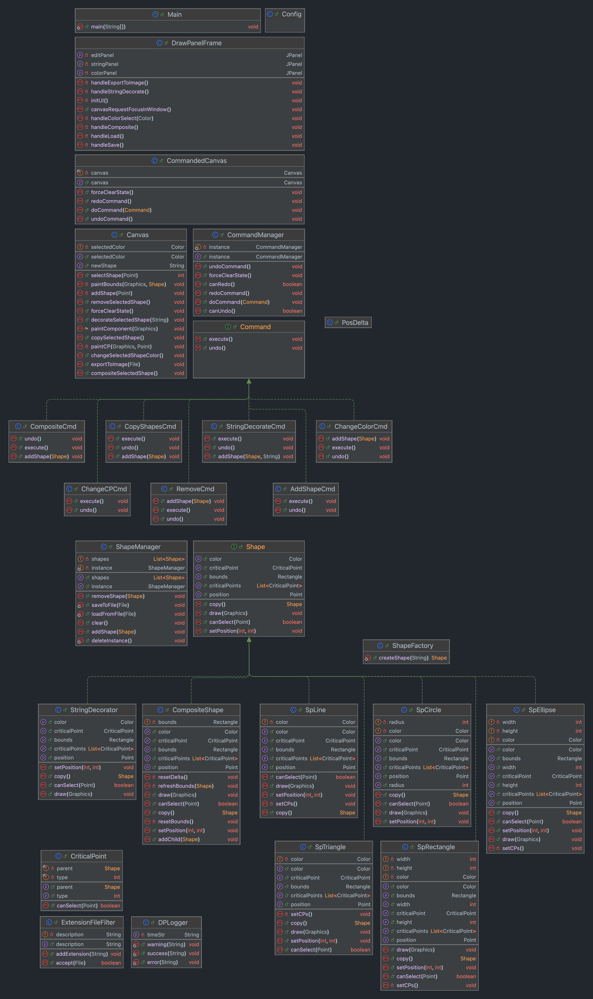

# DrawPanel: Project of OO

This is a drawing software based on Java Swing. This project is my practice of applying design patterns.

这是一个基于 Java Swing 的绘图软件。本项目是我应用设计模式的练习，是南京大学《面向对象设计》的课程项目。

## Project Structure (v1.0) 项目结构（v1.0）

> This image is up-to-date. 此图为最新版本。



> [!WARNING]
> This project uses the MIT open-source license. The related copyright notice and permission notice shall be included in all copies or substantial portions of the Software.
> 本项目使用 MIT 开源许可证，在软件和软件（部分或整体）的所有副本中都必须包含相关著作权声明和许可声明（LICENSE）。

## Design Patterns 设计模式

### 1. Abstract Factory 抽象工厂模式

The `ShapeFactory` class uses the Abstract Factory pattern to create different types of shapes. This allows for the creation of families of related or dependent objects without specifying their concrete classes.

`ShapeFactory` 类使用抽象工厂模式来创建不同类型的形状。这使得可以创建一系列相关或相互依赖的对象，而无需指定它们的具体类。

### 2. Composite 组合模式

The `GroupShape` class implements the Composite pattern, allowing individual shapes and groups of shapes to be treated uniformly. This is useful for operations that can be applied to both single shapes and groups of shapes.

`GroupShape` 类实现了组合模式，使得可以统一处理单个形状和形状组。这对于可以同时应用于单个形状和形状组的操作非常有用。

### 3. Singleton 单例模式

The `ShapeManager` class uses the Singleton pattern to ensure that there is only one instance of the shape manager. This is crucial for maintaining a single collection of shapes and ensuring consistent state across the application.

`ShapeManager` 类使用单例模式来确保形状管理器只有一个实例。这对于维护形状的单一集合并确保应用程序中的一致状态至关重要。

### 4. Prototype 原型模式

Shapes implement the Prototype pattern by providing a `copy` method that allows for cloning of shapes. This is useful for duplicating shapes while maintaining their current state.

形状通过提供 `copy` 方法实现原型模式，从而允许克隆形状。这对于在保持形状当前状态的同时复制形状非常有用。

### 5. Decorator 装饰器模式

The `StringDecorator` class uses the Decorator pattern to add additional functionality (like descriptions) to shapes dynamically. This provides a flexible alternative to subclassing for extending functionality.

`StringDecorator` 类使用装饰器模式来动态地向形状添加附加功能（如描述）。这为扩展功能提供了一种灵活的替代子类化的方法。

### 6. Command 命令模式

The command pattern is used to implement undoable operations. Commands encapsulate a request as an object, thereby allowing for parameterization of clients with different requests, queuing of requests, and logging of the requests. It also supports undoable operations.

命令模式用于实现可撤销的操作。命令将请求封装为对象，从而允许使用不同请求参数化客户端、请求排队和请求日志记录。它还支持可撤销的操作。

### 7. Facade 外观模式

The `CommandedCanvas` class acts as a facade that simplifies interactions between the user interface and the underlying command infrastructure. This helps in reducing the complexity of the subsystem and makes the API easier to use.

`CommandedCanvas` 类充当一个外观，简化了用户界面和底层命令基础结构之间的交互。这有助于减少子系统的复杂性，并使 API 更易于使用。

### 8. Observer 观察者模式

CriticalPoints in shapes implement the Observer pattern. When a critical point is moved, the shape is notified and updates its structure accordingly. This ensures that changes in critical points are reflected in the shape's geometry.

形状中的关键点实现了观察者模式。当一个关键点移动时，形状会收到通知并相应地更新其结构。这确保了关键点的变化会反映在形状的几何结构中。

## Features 功能

### Basic Features 基础功能需求

1. Well-designed graphical user interface with at least five default shapes (triangle, rectangle, circle, ellipse, and connecting line) for users to choose and draw on the canvas. 设计良好的图形用户界面，界面中要求至少有默认大小的三角形、方框、圆形、椭圆、连接线等五种元素可供用户选择后，绘制到画布上。 ✅
2. Allow users to add text descriptions. 允许用户添加文字描述。 ✅
3. Click to select shapes and allow copying of shapes. 单击可以选中图形，并允许对图形的拷贝复制。 ✅
4. Multiple shapes can be grouped, and the grouped shapes can also be copied. 多个图形可以组合，组合后的图形同样有拷贝复制的功能。✅
5. Support for undoing the last operation. 支持撤销上一步操作的功能。 ✅

### Extended Features 扩展功能需求

1. Support for resizing shapes (including grouped shapes) by dragging. 支持图形（包括组合图形）的拖拽调整图形大小。 ✅
2. Support for multi-step undo functionality. 支持撤销多步的功能。 ✅
3. Design a file storage format to save user-drawn shapes and load them. We specify *.dps as the file extension for DrawPanel files. 设计一种硬盘文件存储格式可以保存用户绘制的图形，并可以加载。我们规定 *.dps 为 DrawPanel 文件的后缀名。 ✅
4. Additionally, export the canvas content as an image. 同时，还可以将画布内容导出为图片。✅

## How to Run the Program 如何运行程序

> [!NOTE]
> If you just want to try this DrawingPanel, you can download the JAR file and run it. (with JDK 14 or Higher)
> 如果你只是想尝试使用这个应用，可以直接下载 JAR 包并运行。（依赖 JDK 14 或更高版本）

### Prerequisites 前提条件

- Java Development Kit (JDK) 14 or higher.
- An IDE such as IntelliJ IDEA (recommended).

- Java 开发工具包（JDK）14 或更高版本。
- 一个集成开发环境（IDE），推荐 IntelliJ IDEA。

### Steps 步骤

1. **Clone the repository 克隆仓库**

   ```bash
   git clone https://github.com/WenzeJin/DrawingPanel.git
   cd DrawPanel
   ```

2. **Open the project in your IDE 在 IDE 中打开项目**

    Open the project in IDEA. 在 IDEA 中打开项目。

3. **Run the application 运行应用程序**

   Locate the `Main` class in the `src/main/java` directory. Right-click on it and select `Run`.

   在 `src/main/java` 目录中找到 `Main` 类。右键点击它并选择 `运行`。

4. **Using the application 使用应用程序**

    - Select a shape from the toolbar and draw it on the canvas.
    - Use the text tool to add descriptions.
    - Select, move, and resize shapes using the critical points.
    - Group shapes and perform undo/redo operations.
    - Save your drawing to a `.dps` file or export it as an image.

    - 从工具栏中选择一个形状并在画布上绘制它。
    - 使用文本工具添加描述。
    - 使用关键点选择、移动和调整形状大小。
    - 组合形状并执行撤销/重做操作。
    - 将你的绘图保存为 `.dps` 文件或导出为图片。